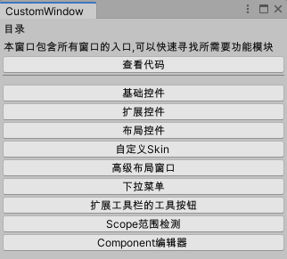
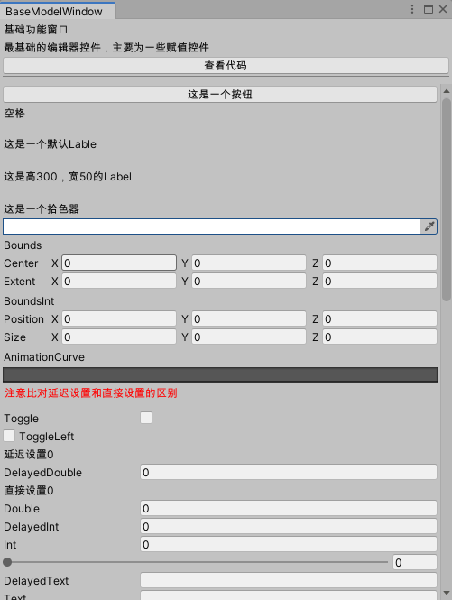
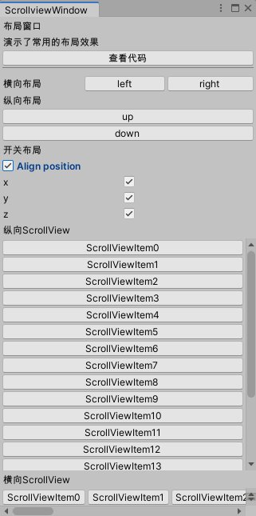
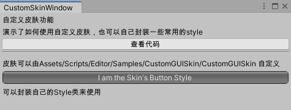
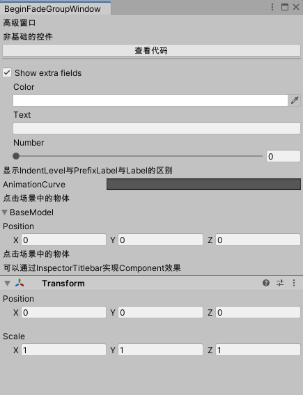
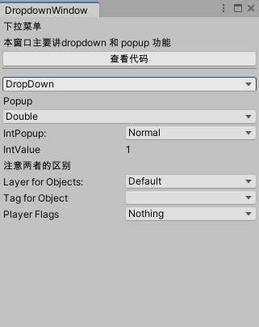
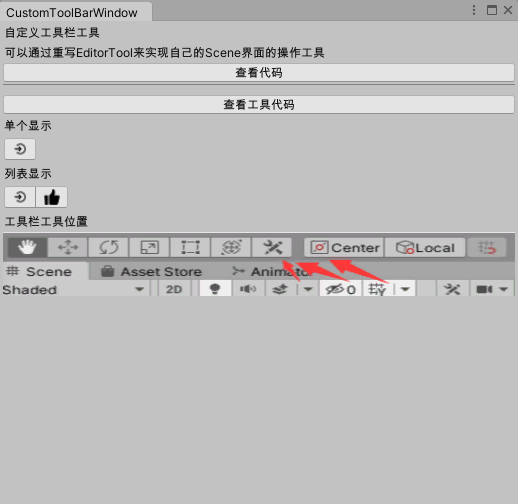
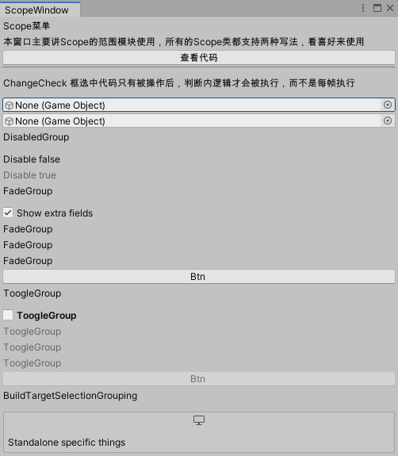
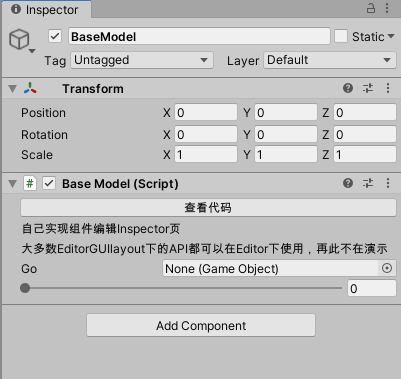

# Unity编辑器组件图形化Wiki

## 前言 

### 这个项目是面向刚开始想要或需要在Unity中制作自定义工具的伙伴，提供一个快速熟悉编辑器UnityEditorLayout,EditorGUI,GUILayout等API的工程。可以通过直接看UI的表现效果来查找自己需要的API，当然也会包括一些常用的编辑器扩展方法以及简单封装来加快使用者的开发效率。最初是考虑到将新出的[UIElement](https://github.com/Unity-Technologies/UIElementsExamples)也添加上，后来发现官方已经做了样例工程，这里就没必要再做了。

### 其中主要展示的带Layout的组件，和不带Layout的主要区别就是，不要Layout的组件需要自己提供Rect即组件绘制的位置。

### 组件的Inspector页面只做了一个最基础的页面显示，因为大部分使用的都是相同的API所以没有重复编写。

### 项目的扩展控件部分应该会持续更新，后续可能会把一些封装好的组件搬运上去。

### 如果你是刚开始接触Unity编辑器这块，我相信这块代码如果全过一遍，在后续开发中绝对不会出现想要什么效果却因不知其API名字而困扰。

## 部分展示图

